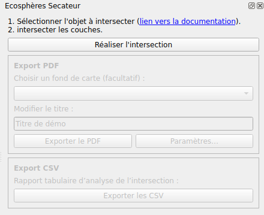
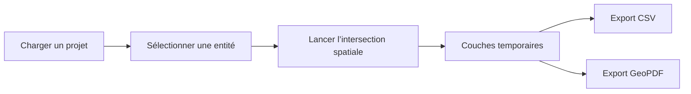
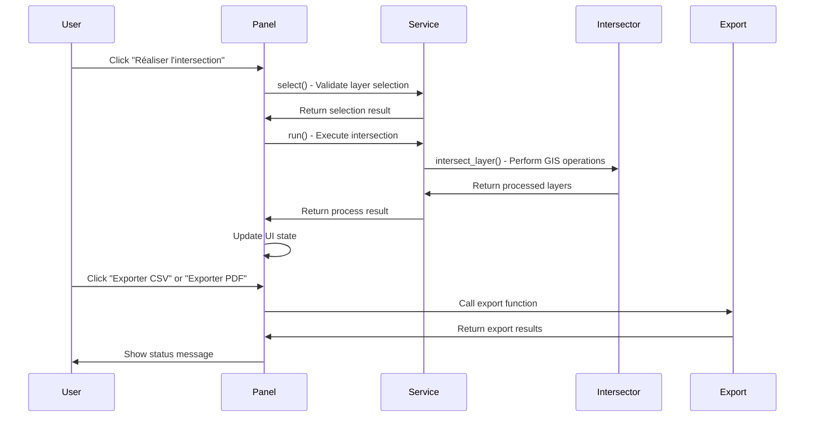
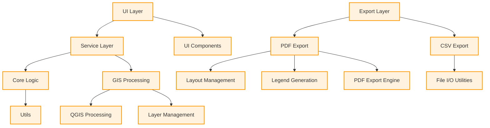

<p align="center">
  
</p>

<p align="center">
Plugin QGIS d’intersection spatiale automatique pour l’analyse territoriale et la production de GeoPDF multicouches.
</p>

<p align="center">
<a href="https://www.python.org/">
  
</a>
<a href="https://qgis.org/">
  
</a>


</p>


# ⚡ Quick Start

```text
1. Charger un projet QGIS
2. Sélectionner une parcelle
3. Cliquer sur "Réaliser l’intersection"
4. Exporter en CSV ou GeoPDF
```


## 📖 Sommaire

1. [⚡ Quick Start](#-quick-start)
2. [🖼️ Aperçu](#️-aperçu)
3. [🎯 Présentation](#-présentation)
4. [👥 Contexte et besoin métier](#contexte-et-besoin-métier)
5. [✂️ Fonctionnalités](#-fonctionnalités)
   - [✨ Fonctionnalités clefs](#-fonctionnalités-clefs)
   - [Intersection spatiale automatique](#intersection-spatiale-automatique)
   - [Gestion automatique des groupes QGIS](#gestion-automatique-des-groupes-qgis)
   - [Export CSV](#export-csv)
   - [Export GeoPDF](#export-geopdf)
   - [Compatibilité données](#compatibilité-données)
6. [🌱 Prérequis](#prérequis)
   - [Logiciels](#logiciels)
   - [Données](#données)
   - [Dépendances Python](#dépendances-python)
7. [📦 Installation](#-installation)
   - [Depuis le ZIP](#depuis-le-zip)
   - [Depuis les sources](#depuis-les-sources)
8. [🚀 Utilisation détaillée](#-utilisation-détaillée)
   - [1. Charger un projet QGIS](#1-charger-un-projet-qgis)
   - [2. Ouvrir le panneau Sécateur](#2-ouvrir-le-panneau-sécateur)
   - [3. Sélectionner une entité](#3-sélectionner-une-entité)
   - [4. Lancer l'intersection](#4-lancer-lintersection)
   - [5. Exporter les résultats](#5-exporter-les-résultats)
   - [Workflow détaillé](#workflow-détaillé)
   - [Export PDF / GeoPDF](#export-pdf--geopdf)
9. [🎨 Personnalisation des modèles QPT](#-personnalisation-des-modèles-qpt)
   - [Modifier un modèle](#modifier-un-modèle)
   - [IDs obligatoires](#ids-obligatoires)
10. [🏗️ Architecture technique](#️-architecture-technique)
    - [Structure du projet](#structure-du-projet)
    - [Architecture logicielle](#architecture-logicielle)
    - [Couches principales](#couches-principales)
    - [Traitements QGIS utilisés](#traitements-qgis-utilisés)
    - [Gestion CRS](#gestion-crs)
    - [Logs](#logs)
    - [Diagramme de séquence](#diagramme-de-séquence)
    - [Diagramme](#diagramme)
11. [🛠️ Développement](#️-développement)
    - [Rechargement rapide](#rechargement-rapide)
    - [Installation environnement](#installation-environnement)
    - [Qualité de code](#qualité-de-code)
    - [Packaging](#packaging)
12. [🧯 Dépannage](#-dépannage)
13. [Limitations connues](#limitations-connues)
14. [🙏 Remerciements](#-remerciements)
15. [🧭 Crédit](#-crédit)


## 🖼️ Aperçu


*Exemple : Panneau Sécateur dans QGIS au démarrage.*

# 🎯Présentation

**Ecosphères Sécateur** est un plugin QGIS permettant d’automatiser des opérations d’intersection spatiale sur un grand nombre de couches géographiques.

Le plugin a été conçu pour répondre à des besoins d’instruction territoriale et réglementaire :

- identification automatique des zonages impactant une parcelle ;
- croisement rapide de données métiers ;
- génération de rapports exploitables ;
- production de GeoPDF multicouches.

Le fonctionnement repose sur un principe simple :

1. sélectionner une seule entité ;
2. lancer l’intersection ;
3. générer automatiquement les couches résultats ;
4. exporter les résultats au format CSV et/ou GeoPDF.


# 👥 Contexte et besoin métier

Le plugin s’inspire directement des problématiques rencontrées lors de l’instruction ADS (Application du Droit des Sols) en DDT, notamment dans le cadre de l’analyse :

- des Servitudes d’Utilité Publique (SUP),
- des zonages réglementaires,
- des risques,
- des contraintes environnementales,
- des documents d’urbanisme.

Dans de nombreux contextes métier, les instructeurs doivent consulter une grande quantité de couches thématiques afin de déterminer quels enjeux concernent une parcelle cadastrale donnée. Cette opération devient rapidement longue, répétitive et source d’erreurs lorsqu’elle est réalisée manuellement.

Le besoin fonctionnel identifié était donc :

- automatiser les intersections spatiales ;
- fiabiliser les analyses ;
- standardiser les exports ;
- produire des rapports cartographiques exploitables.

Le plugin reprend cette logique dans une approche plus modulaire et générique adaptée à QGIS 3.34+.

Les problématiques métier d’origine sont détaillées dans la notice DDT21 du plugin historique « Instruction_ADS ».


<details>
<summary><h1>✂️ Fonctionnalités</h1></summary><br>

## ✨ Fonctionnalités clefs

| Fonction | Description |
|---|---|
| ✂️ Intersection automatique | Intersection de toutes les couches visibles |
| 🌍 Reprojection CRS | Harmonisation automatique des projections |
| 🛠️ Correction géométries | Utilisation de `native:fixgeometries` |
| 📄 Export CSV | Export tabulaire des intersections |
| 🗺️ GeoPDF | PDF multicouches interactif |
| 📚 Légende dynamique | Génération automatique |
| 🧱 WFS support | Compatible flux distants |

## Intersection spatiale automatique

- intersection d’une entité avec toutes les couches visibles ;
- prise en charge des couches locales et WFS ;
- reprojection automatique dans le CRS du projet ;
- correction automatique des géométries invalides ;
- création automatique des couches résultats.


## Gestion automatique des groupes QGIS

Le plugin crée automatiquement :

```text
Résultats secateur
```

et :

```text
Objets créés
```

afin d’organiser les données temporaires.


## Export CSV

- un CSV par couche intersectée ;
- export des attributs ;
- format compatible tableurs et traitements externes.


## Export GeoPDF

- génération d’un GeoPDF multicouches ;
- légende séparée ;
- prise en charge des basemaps ;
- export basé sur des modèles `.qpt`.


## Compatibilité données

Compatible avec :

- couches locales ;
- couches WFS ;
- couches métiers ;
- couches cadastrales ;
- orthophotos ;
- fonds raster.

</details><br>


<details>
<summary><h1>🌱 Prérequis</h1></summary><br>

## Logiciels

- QGIS ≥ 3.34


## Données

Le plugin nécessite :

- un projet QGIS contenant des couches exploitables ;
- idéalement des couches cadastrales ;
- des couches métiers organisées dans le projet.

Les couches cadastrales peuvent provenir :

- du projet QGIS ;
- de flux WFS ;
- de la BD Parcellaire ;
- du plugin Cadreur ;
- de l’API Admin Express ;
- d’autres sources IGN ou métiers.


## Dépendances Python

Le plugin embarque certaines dépendances dans `vendor/` afin de garantir un fonctionnement autonome.

Notamment :

- `pypdf`
    

Cela augmente légèrement la taille du plugin mais évite toute installation manuelle.

</details><br>

<details>
<summary><h1>📦 Installation</h1></summary><br>

## Depuis le ZIP

1. Télécharger le plugin ;
2. Ouvrir QGIS ;
3. Aller dans :
```text
Extensions → Installer/Gérer les extensions
```

4. Choisir :

```text
Installer depuis un ZIP
```

5. Sélectionner l’archive ;
6. Activer le plugin.


## Depuis les sources

### Linux

```bash
ln -s /chemin/vers/ecospheres-secateur \
~/.local/share/QGIS/QGIS3/profiles/default/python/plugins/ecospheres-secateur
```

### macOS

```bash
ln -s /chemin/vers/ecospheres-secateur \
~/Library/Application\ Support/QGIS/QGIS3/profiles/default/python/plugins/ecospheres-secateur
```

### Windows

Créer un lien symbolique ou copier le dossier dans :

```text
C:\Users\<user>\AppData\Roaming\QGIS\QGIS3\profiles\default\python\plugins\
```

Puis dans QGIS :

```text
Extensions → Gérer/Installer les extensions → Ecosphères Sécateur → Activer
```

</details><br>

<details>
<summary><h1>🚀 Utilisation détaillée</h1></summary><br>

## 1. Charger un projet QGIS

Le plugin fonctionne avec :

- couches WFS ;
- couches locales ;
- couches métiers ;
- couches raster ;
- orthophotos ;
- basemaps.

> [!WARNING]
>
> Les exports utilisant des couches WFS ou des basemaps peuvent être significativement plus longs.
>
> Dans certains cas :
>
> - les temps d’export peuvent être multipliés par 10 ;
> - QGIS peut sembler figé pendant certains traitements lourds.
>
> Cela est normal, il faut requêter les couches.
>


## 2. Ouvrir le panneau Sécateur

Cliquer sur l’icône :

```text
Ecosphères Sécateur
```

dans la barre d’outils QGIS.

Le panneau permet :

- le lancement des intersections ;
- les exports CSV ;
- les exports PDF ;
- le choix du fond cartographique ;
- la configuration des exports.


## 3. Sélectionner une entité

Le plugin fonctionne avec :

- une couche active ;
- une seule entité sélectionnée.

### Sélection d’une couche

Dans l’arbre des couches :

1. cliquer sur une couche vectorielle ;
2. la rendre active.


### Sélection d’une entité

Utiliser l’outil QGIS :

```text
Sélectionner des entités
```

Puis sélectionner une seule géométrie.

⚠️ Le plugin nécessite exactement :

```text
1 entité sélectionnée
```

Sinon l’exécution sera refusée.


## 4. Lancer l’intersection

Cliquer sur :

```text
Réaliser l’intersection
```

Le plugin :

1. détecte les couches visibles ;
2. ignore les couches incompatibles ;
3. reprojette les données ;
4. corrige les géométries ;
5. applique les intersections ;
6. génère les couches résultats ;
7. crée les groupes QGIS nécessaires.

Les résultats apparaissent dans :

```text
Résultats secateur
```


## 5. Exporter les résultats

### Export CSV

Produit :

- un CSV par couche intersectée ;
- les attributs des objets intersectés.


### Export PDF

Produit :

- un GeoPDF multicouches ;
- une légende PDF séparée ;
- une mise en page basée sur des modèles QGIS `.qpt`.


## Workflow détaillé




## Export PDF / GeoPDF

### Le GeoPDF

Le plugin produit des GeoPDF interactifs.

Contrairement à un PDF classique, un GeoPDF permet :

- l’affichage de couches ;
- l’activation/désactivation des calques ;
- le zoom ;
- la navigation cartographique ;
- la consultation des attributs.

Le document est lisible dans :

- Adobe Acrobat Reader.


#### Intérêt du GeoPDF

Dans les contextes réglementaires, de nombreux zonages se superposent :

- SUP ;
- risques ;
- urbanisme ;
- environnement ;
- réseaux ;
- biodiversité.

Le GeoPDF permet alors :

- de masquer certaines couches ;
- d’analyser les intersections individuellement ;
- de conserver une lecture exploitable.

La logique est similaire à celle d’un projet QGIS simplifié embarqué dans un PDF.

Les usages historiques du GeoPDF sont décrits dans la documentation DDT21 du plugin ADS.


### Gestion des légendes

Les légendes sont exportées séparément afin d’éviter :

- la surcharge graphique ;
- les crashs QGIS ;
- les limitations des layouts.

Le plugin :

1. génère dynamiquement les légendes ;
2. crée des pages adaptées ;
3. fusionne les exports PDF.
</details><br>

<details>
<summary><h1>🎨 Personnalisation des modèles QPT</h1></summary><br>

# Personnalisation des modèles QPT

Le plugin utilise deux modèles QGIS `.qpt`.

## GeoPDF

```text
resources/report_page.qpt
```

## Légende

```text
resources/legend_layout.qpt
```


# Modifier un modèle

Dans QGIS :

```text
Projet → Gestionnaire de mises en page
```

Puis :

```text
Nouvelle mise en page depuis un modèle
```

Ensuite :

1. importer le `.qpt` ;
2. modifier les éléments souhaités ;
3. sauvegarder le fichier au même emplacement.


# IDs obligatoires

Certains éléments doivent conserver leur ID.

## Layout principal

| Élément | ID |
|---|---|
| Carte | `Map 1` |
| Titre | `title` |
| Auteur | `author` |
| Date | `date` |
| Logo | `logo` |

## Layout légende

| Élément | ID |
|---|---|
| Légende | `legend` |

</details><br>


<details>
<summary><h1> 🏗️ Architecture technique</h1></summary><br>

## Structure du projet

```text
ecospheres-secateur/
├── __init__.py
├── metadata.txt
├── plugin.py
├── core/
│   ├── export/
│   ├── utils/
│   └── intersector.py
├── ui/
├── resources/
└── vendor/
```

## Architecture logicielle

Le plugin suit une architecture :

- modulaire ;
- orientée services ;
- découplée UI / métier.


## Couches principales

|Module|Rôle|
|||
|`plugin.py`|Point d’entrée QGIS|
|`ui/panel.py`|Interface utilisateur|
|`ui/service.py`|Logique métier|
|`core/intersector.py`|Intersections spatiales|
|`core/export/`|Exports CSV/PDF|
|`core/utils/`|Helpers et utilitaires|


## Traitements QGIS utilisés

Le plugin repose principalement sur :

- `native:extractbylocation`
- `native:fixgeometries`
- `native:reprojectlayer`
- `gdal:warpreproject`


## Gestion CRS

Toutes les couches sont reprojetées dans le CRS du projet avant traitement.


## Logs

Le plugin utilise le système de logs natif de QGIS.

Les messages sont visibles dans :

```text
Vue → Panneaux → Journal des messages
```

## Diagramme de séquence


## Diagramme

</details><br>

<details>
<summary><h1> 🛠️ Développement</h1></summary><br>

## Rechargement rapide

Le plugin est compatible avec [Plugin Reloader](https://plugins.qgis.org/plugins/plugin_reloader)

Source : https://github.com/borysiasty/plugin_reloader


## Installation environnement

```bash
uv sync
```


# Qualité de code

Outils utilisés :

- Ruff
- Pyright
- pre-commit
- uv


## Vérifications

```bash
uv run pre-commit install

uv run ruff check --fix .
uv run ruff format .
uv run pyright
```


# Packaging

## Génération ZIP

```bash
zip -r ecospheres-secateur.zip ecospheres-secateur -x "*/.*"
```

</details><br>

<details>
<summary><h1> 🧯 Dépannage</h1></summary><br>

# Le plugin ne détecte aucune couche

**Cause possible** :
- Les couches ne sont pas visibles dans QGIS.
- Les couches ne sont pas vectorielles.

**Solution** :
1. Dans QGIS, cochez la case **Visible** pour chaque couche à analyser.
2. Vérifiez que les couches sont bien au format vectoriel (pas raster).
3. Redémarrez QGIS si le problème persiste.


# Le plugin refuse l’exécution

Vérifier :

- qu’une couche active existe ;
- qu’une seule entité est sélectionnée.


# Le GeoPDF ne fonctionne pas correctement

Certaines couches peuvent :

- contenir des géométries invalides ;
- avoir trop de sommets ;
- provoquer des crashs QGIS.

Dans ce cas :

1. exécuter :

```text
Corriger les géométries
```

2. éventuellement simplifier les géométries.

Les problématiques historiques de génération GeoPDF sont documentées dans la documentation DDT21.


# QGIS semble figé

Certaines opérations :

- WFS ;
- exports PDF ;
- intersections massives ;

peuvent être longues.

QGIS peut sembler bloqué pendant les traitements.

Patientez jusqu’à la fin du processus.

</details><br>

# Limitations connues

- traitements potentiellement longs sur gros projets ;
- exports WFS coûteux ;
- GeoPDF sensible aux géométries invalides ;
- certaines couches très lourdes peuvent provoquer des ralentissements.


# 🙏 Remerciements

- DDT21
- utilisateurs testeurs
- contributeurs et relecteurs


# 🧭 Crédit

Développé dans le cadre des travaux autour des outils Ecosphères / QGIS et des problématiques d’analyse territoriale automatisée.