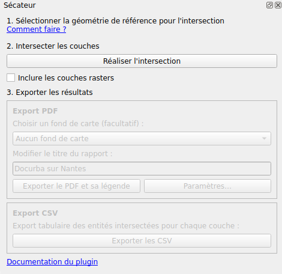
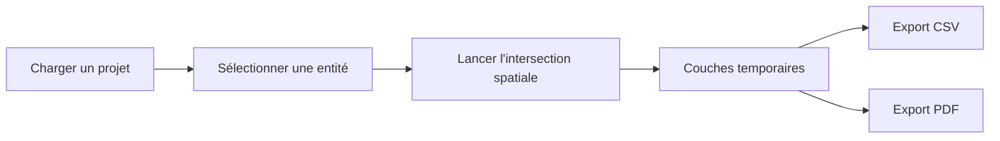
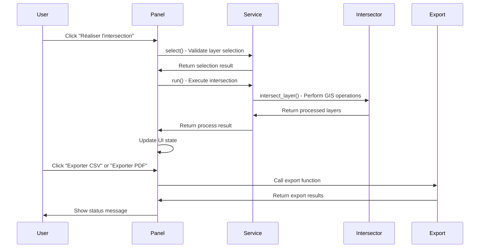

<p align="center">
  
</p>

<p align="center">
Plugin QGIS d'intersection spatiale automatique pour l'analyse territoriale et la production de PDF multicouches.
</p>

<p align="center">
<a href="https://www.python.org/">
  
</a>
<a href="https://qgis.org/">
  
</a>


</p>


# ⚡ Quick Start


### <kbd>[**Télécharger le plugin**](https://github.com/ecolabdata/secateur/archive/refs/heads/main.zip)</kbd>


```text
1. Charger un projet QGIS
2. Sélectionner une parcelle
3. Cliquer sur "Réaliser l'intersection"
4. Exporter en PDF ou CSV
```


## 📖 Sommaire

1. [⚡ Quick Start](#-quick-start)
3. [🎯 Présentation](#-présentation)
4. [👥 Contexte et besoin métier](#contexte-et-besoin-métier)
5. [✂️ Fonctionnalités](#-fonctionnalités)
   - [✨ Fonctionnalités clefs](#-fonctionnalités-clefs)
   - [Intersection spatiale automatique](#intersection-spatiale-automatique)
   - [Gestion automatique des groupes QGIS](#gestion-automatique-des-groupes-qgis)
   - [Export CSV](#export-csv)
   - [Export Geo](#export-pdf)
   - [Compatibilité données](#compatibilité-données)
6. [🌱 Prérequis](#prérequis)
   - [Logiciels](#logiciels)
   - [Données](#données)
   - [Dépendances Python](#dépendances-python)
7. [📦 Installation](#-installation)
   - [Depuis le ZIP](#depuis-le-zip)
   - [Depuis les sources](#depuis-les-sources)
8. [🚀 Utilisation détaillée](#-utilisation-détaillée)
   - [1. Charger un projet QGIS](#1-charger-un-projet-qgis)
   - [2. Ouvrir le panneau Sécateur](#2-ouvrir-le-panneau-sécateur)
   - [3. Sélectionner une entité](#3-sélectionner-une-entité)
   - [4. Lancer l'intersection](#4-lancer-lintersection)
   - [5. Exporter les résultats](#5-exporter-les-résultats)
   - [Workflow détaillé](#workflow-détaillé)
   - [Export PDF](#export-pdf)
9. [🎨 Personnalisation des modèles QPT](#-personnalisation-des-modèles-qpt)
   - [Modifier un modèle](#modifier-un-modèle)
   - [IDs obligatoires](#ids-obligatoires)
10. [🏗️ Architecture technique](#️-architecture-technique)
    - [Structure du projet](#structure-du-projet)
    - [Architecture logicielle](#architecture-logicielle)
    - [Couches principales](#couches-principales)
    - [Traitements QGIS utilisés](#traitements-qgis-utilisés)
    - [Gestion CRS](#gestion-crs)
    - [Logs](#logs)
    - [Diagramme de séquence](#diagramme-de-séquence)
    - [Diagramme](#diagramme)
11. [🛠️ Développement](#️-développement)
    - [Rechargement rapide](#rechargement-rapide)
    - [Installation environnement](#installation-environnement)
    - [Qualité de code](#qualité-de-code)
    - [Packaging](#packaging)
12. [🧯 Dépannage](#-dépannage)
13. [Limitations connues](#limitations-connues)
14. [🙏 Remerciements](#-remerciements)
15. [🧭 Crédit](#-crédit)


# 🎯Présentation

**Sécateur** est un plugin QGIS permettant d'automatiser des opérations d'intersection spatiale sur un grand nombre de couches géographiques.

Le plugin a été conçu pour répondre à des besoins d'instruction territoriale et réglementaire :

- identification automatique des zonages impactant une entitée cadastrale via le croisement rapide de données métiers ;
- génération de rapports exploitables via la production de PDF multicouches.

Le fonctionnement repose sur un principe simple :

1. sélectionner une seule entité ;
2. lancer l'intersection et générer automatiquement les couches résultats ;
3. exporter les résultats au format PDF et/ou CSV.


# 👥 Contexte et besoin métier

Le plugin s'inspire directement des problématiques rencontrées lors de l'instruction d'application du droit des sols (ADS) en DDT, notamment dans le cadre de l'analyse :

- des Servitudes d'Utilité Publique (SUP),
- des zonages réglementaires,
- des risques,
- des contraintes environnementales,
- des documents d'urbanisme.

Dans de nombreux contextes métier, les instructeurs doivent consulter une grande quantité de couches thématiques afin de déterminer quels enjeux concernent une parcelle cadastrale donnée. Cette opération devient rapidement longue, répétitive et source d'erreurs lorsqu'elle est réalisée manuellement.

Le besoin fonctionnel identifié était donc :

- automatiser les intersections spatiales ;
- fiabiliser les analyses ;
- standardiser les exports ;
- produire des rapports cartographiques exploitables.

Le plugin reprend cette logique dans une approche plus modulaire et générique adaptée à QGIS 3.34+.

Les problématiques métier d'origine sont détaillées dans la notice DDT21 du plugin historique « [Instruction_ADS](https://github.com/tomflyjc/Instruction_ADS) ».


<details>
<summary><h1>✂️ Fonctionnalités</h1></summary><br>

## ✨ Fonctionnalités clefs

| Fonction | Description |
|---|---|
| ✂️ Intersection spatiale | Intersection de toutes les **couches visibles** |
| 🌍 Reprojection CRS | Harmonisation des projections |
| 🛠️ Correction géométries | Correction des géométries invalides |
| 📄 Export CSV | Export tabulaire des intersections |
| 🗺️ PDF | PDF multicouches |
| 📚 Légende dynamique | Génération automatique |
| 🧱 WFS/WMS support | Compatible flux distants |


## Gestion automatique des groupes QGIS

Le plugin crée automatiquement un groupe résultat : `Résultats secateur` et `Objets cible` afin d'organiser les données temporaires.


## Export CSV

- un CSV par couche intersectée ;
- export des attributs ;
- format compatible tableurs et traitements externes.


## Export PDF

- génération d'un PDF multicouches ;
- légende séparée ;
- prise en charge des basemaps ;
- export basé sur des modèles `.qpt`.


## Compatibilité données

Compatible avec :

- couches locales ;
- couches WFS/WMS ;
- couches métiers ;
- couches cadastrales ;
- orthophotos ;
- fonds raster.

</details><br>


<details>
<summary><h1>🌱 Prérequis</h1></summary><br>

## Logiciels

- QGIS ≥ 3.34


## Données

Le plugin nécessite :

- un projet QGIS contenant des couches vectorielles ou rasteurs ;
- des couches métiers organisées dans le projet.

Les couches cadastrales peuvent provenir :

- du projet QGIS ;
- de flux WFS/wMS ;
- de la BD Parcellaire ;
- du plugin Cadreur ;
- d'autres sources IGN ou métiers.


## Dépendances Python

Le plugin embarque certaines dépendances dans `vendor/` afin de garantir un fonctionnement autonome (notamment `pypdf`). Cela augmente légèrement la taille du plugin mais évite toute installation manuelle.

</details><br>

<details>
<summary><h1>📦 Installation</h1></summary><br>

## Depuis le ZIP

1. [Télécharger le plugin en zip](https://github.com/ecolabdata/secateur/archive/refs/heads/main.zip) ;
2. Ouvrir QGIS ;
3. Aller dans : `Extensions → Installer/Gérer les extensions`
4. Choisir : `Installer depuis un ZIP`
5. Sélectionner l'archive ;
6. Activer le plugin.


## Depuis les sources

### Linux

```bash
ln -s /chemin/vers/secateur \
~/.local/share/QGIS/QGIS3/profiles/default/python/plugins/secateur
```

### macOS

```bash
ln -s /chemin/vers/secateur \
~/Library/Application\ Support/QGIS/QGIS3/profiles/default/python/plugins/secateur
```

### Windows

Créer un lien symbolique ou copier le dossier dans :

```text
C:\Users\<user>\AppData\Roaming\QGIS\QGIS3\profiles\default\python\plugins\
```

Puis dans QGIS :

```text
Extensions → Gérer/Installer les extensions → Sécateur → Activer
```

</details><br>

<details>
<summary><h1>🚀 Utilisation détaillée</h1></summary><br>

## 1. Charger un projet QGIS

Le plugin fonctionne avec toutes les couches de QGIS.

> [!WARNING]
>
> Les exports utilisant des couches WFS/WMS ou des basemaps peuvent être significativement plus longs.
>
> Dans certains cas :
>
> - les temps d'export peuvent être multipliés par 10 ;
> - QGIS peut sembler figé pendant certains traitements lourds.
>
> Cela est normal, il faut requêter les couches.
>


## 2. Ouvrir le panneau Sécateur

Cliquer sur l'icône dans la barre d'outils QGIS :


Le panneau permet :



- le lancement des intersections ;
- le choix du fond cartographique ;
- la configuration des exports ;
- les exports PDF ;
- les exports CSV.


## 3. Sélectionner une entité

Le plugin fonctionne avec :

- une couche active ;

OU
- une seule entité sélectionnée.

### Sélection d'une couche

Dans l'arbre des couches :

1. cliquer sur une couche vectorielle ;
2. la rendre active.


### Sélection d'une entité

Utiliser l'outil QGIS :


Puis sélectionner une seule géométrie.

> [!WARNING]
> Le plugin nécessite exactement **1 entité sélectionnée** sinon l'exécution sera refusée.


## 4. Lancer l'intersection

Cliquer sur :

```text
Réaliser l'intersection
```

Le plugin :

1. détecte les couches visibles ;
2. ignore les couches incompatibles ;
3. reprojette les données ;
4. corrige les géométries ;
5. applique les intersections ;
6. génère les couches résultats ;
7. crée les groupes QGIS nécessaires.

Les résultats apparaissent dans :

```text
Résultats secateur
```

> [!WARNING]
> Le plugin fonctionne également avec les **couches rasters**, mais l'intersection est juste un filtre limité aux extents. Pour cela, cochez la case "Inclure les couches rasters".


## 5. Exporter les résultats

### Export CSV

Produit :

- un CSV par couche intersectée ;
- les attributs des objets intersectés.


### Export PDF

Produit :

- un PDF multicouches ;
- une légende PDF séparée ;
- une mise en page basée sur des modèles QGIS `.qpt`.


## Workflow détaillé




## Export PDF

### Le PDF

Aujourd'hui, le plugin produit des PDF multicouches pour une lecture et diffusion rapide.

Historiquement, il produit aussi un GeoPDF ajourd'hui supprimé. Néanmoins, il existe encore dans une branche archivée du projet : https://github.com/ecolabdata/secateur/tree/archive/geopdf-export

Contrairement à un PDF classique, un GeoPDF permet :

- l'affichage de couches ;
- l'activation/désactivation des calques ;
- le zoom ;
- la navigation cartographique ;
- la consultation des attributs.

Le document est lisible dans :

**Sur Windows :**
[Adobe acrobat reader](https://get.adobe.com/fr/reader/)

**Sur Unix :**
Obtenir [Evince](https://en.wikipedia.org/wiki/Evince) :
```
sudo apt-get install evince
```


#### Intérêt du GeoPDF

Dans les contextes réglementaires, de nombreux zonages se superposent :

- SUP ;
- risques ;
- urbanisme ;
- environnement ;
- réseaux ;
- biodiversité.

Le GeoPDF permet alors :

- de masquer certaines couches ;
- d'analyser les intersections individuellement ;
- de conserver une lecture exploitable.

La logique est similaire à celle d'un projet QGIS simplifié embarqué dans un PDF.

Les usages historiques du GeoPDF sont décrits dans la documentation DDT21 du plugin ADS.


### Gestion des légendes

Les légendes sont exportées séparément afin d'éviter :

- la surcharge graphique ;
- les crashs QGIS ;
- les limitations des layouts.

Le plugin :

1. génère dynamiquement les légendes ;
2. crée des pages adaptées ;
3. fusionne les exports PDF.
</details><br>

<details>
<summary><h1>🎨 Personnalisation des modèles QPT</h1></summary><br>

# Personnalisation des modèles QPT

Le plugin utilise deux modèles QGIS `.qpt`.

## PDF

```text
resources/report_page.qpt
```

## Légende

```text
resources/legend_layout.qpt
```


# Modifier un modèle

Dans QGIS (<a href="https://docs.qgis.org/3.34/fr/docs/training_manual/map_composer/map_composer.html" target="_blank">documentation</a>) :

```text
Projet → Gestionnaire de mises en page
```

Puis :

```text
Nouvelle mise en page depuis un modèle
```

Ensuite :

1. importer le `.qpt` ;
2. modifier les éléments souhaités ;
3. sauvegarder le fichier au même emplacement.


# IDs obligatoires

Certains éléments doivent conserver leur ID.

## Layout principal

| Élément | ID |
|---|---|
| Carte | `Map 1` |
| Titre | `title` |
| Auteur | `author` |
| Date | `date` |
| Logo | `logo` |

## Layout légende

| Élément | ID |
|---|---|
| Légende | `legend` |

</details><br>


<details>
<summary><h1> 🏗️ Architecture technique</h1></summary><br>

## Structure du projet

```text
secateur/
├── __init__.py
├── metadata.txt
├── plugin.py
├── core/
│   ├── constants.py
│   ├── logger.py
│   ├── image_manager.py
│   ├── intersection/
│   │   ├── intersection_processing.py
│   │   ├── profiling.py
│   │   ├── intersection_results.py
│   │   ├── intersection_context.py
│   │   └── intersection_metrics.py
│   ├── export/
│   │   ├── csv/
│   │   │   └── export.py
│   │   └── pdf/
│   │       ├── common/
│   │       │   ├── models/
│   │       │   │   ├── __init__.py
│   │       │   │   ├── metadata.py
│   │       │   │   └── pdf_export_options.py
│   │       │   ├── template_loader.py
│   │       │   ├── path_resolver.py
│   │       │   ├── pdf_export.py
│   │       │   ├── lifecycle/
│   │       │   │   ├── cleanup.py
│   │       │   │   └── refresh.py
│   │       │   ├── export/
│   │       │   │   ├── __init__.py
│   │       │   │   ├── base_export_service.py
│   │       │   │   ├── base_export_config_factory.py
│   │       │   │   ├── collaborators.py
│   │       │   │   └── pdf_merger.py
│   │       │   └── layout/
│   │       │       ├── base_layout.py
│   │       │       ├── extent.py
│   │       │       ├── visibility.py
│   │       │       ├── metadata.py
│   │       │       └── metadata_items.py
│   │       ├── multi_pdf/
│   │       │   ├── __init__.py
│   │       │   ├── service.py
│   │       │   ├── config.py
│   │       │   ├── layout_factory.py
│   │       │   ├── items.py
│   │       │   ├── layout.py
│   │       │   └── page_builder.py
│   │       └── legend/
│   │           ├── __init__.py
│   │           ├── service.py
│   │           ├── config.py
│   │           ├── legend_tree.py
│   │           ├── pagination.py
│   │           ├── items.py
│   │           └── layout.py
│   └── utils/
│       ├── __init__.py
│       ├── feedback.py
│       ├── layers.py
│       ├── rendering.py
│       ├── visibility.py
│       ├── layer_resolver.py
│       ├── path.py
│       └── formatting.py
├── ui/
│   ├── panel.py
│   ├── service.py
│   └── widgets/
│       ├── basemap_combo.py
│       └── settings_dialog.py
├── resources/
├── docs/
└── vendor/
```

## Architecture logicielle

Le plugin suit une architecture :

- modulaire ;
- orientée services ;
- découplée UI / métier.


## Couches principales

|Module|Rôle|
|---|---|
|`plugin.py`|Point d'entrée QGIS|
|`ui/panel.py`|Interface utilisateur|
|`ui/service.py`|Logique métier|
|`core/intersection/intersection_processing.py`|Intersections spatiales|
|`core/intersection/intersection_context.py`|Contexte d'intersection|
|`core/intersection/intersection_results.py`|Résultats d'intersection|
|`core/intersection/intersection_metrics.py`|Métriques d'intersection|
|`core/intersection/profiling.py`|Profiling d'intersection|
|`core/export/`|Exports CSV/PDF|
|`core/utils/`|Helpers et utilitaires|
|`core/constants.py`|Constantes du plugin|
|`core/logger.py`|Gestion des logs|
|`core/image_manager.py`|Gestion des images|


## Traitements QGIS utilisés

Le plugin repose principalement sur :

- `native:extractbylocation`
- `native:fixgeometries`
- `native:reprojectlayer`
- `gdal:warpreproject`


## Gestion CRS

Toutes les couches sont reprojetées dans le CRS du projet avant traitement.


## Calcul de l'étendue d'export

La fonction `compute_export_extent` calcule un rectangle englobant (bbox) pour une couche vectorielle donnée, en ajoutant une marge de 5 % de la largeur et de la hauteur du rectangle d'origine, ce qui permet de prendre les entités adjacentes.


## Logs

Le plugin utilise le système de logs natif de QGIS.

Les messages sont visibles dans :

```text
Vue → Panneaux → Journal des messages
```

## Diagramme de séquence


# Choix techniques et leur concrétisation dans la codebase

L'architecture observée repose sur cinq principes structurants :

- **Délégation maximale à QGIS**
- **Découplage métier / UI**
- **Isolation des objets générés**
- **Optimisation des traitements géospatiaux**
- **Forte orientation export et reproductibilité**

On se propose ici de détailler les 14 choix techniques prépondérants :

1. Indépendance des formats de données et API.
2. S'appuyer au maximum sur les fonctions QGIS.
3. Utilisation de la visibilité des couches.
4. Groupe temporaire pour la symbologie.
5. Optimisation des traitements d'intersection.
6. Gestion spécifique des couches raster.
7. Fond de carte via groupe dédié.
8. Utilisation massive de dataclass et séparation métier/service.
9. UX pilotée par ``set_status``.
10. Interface volontairement minimaliste.
11. Utilisation de modèles QPT pour les PDF.
12. Pagination basée sur des seuils fixes.
13. Utilisation de pypdf pour fusionner les pages.
14. Utilisation du répertoire ``vendor/``.
15. Ajout d'une marge de 5 % à la bbox.

## 1. Indépendance des formats de données et API

### Choix
Fonctionner avec le plus de cas d'usage possible sans dépendre d'un format de données particulier ni d'une API externe.

### Implémentation
- Le cœur applicatif manipule les abstractions QGIS :
  - `QgsMapLayer`
  - `QgsVectorLayer`
  - `QgsRasterLayer`
- Aucun couplage métier à :
  - GeoJSON
  - PostGIS
  - API REST
  - structure de données spécifique
- Les traitements travaillent sur des couches préparées (`PreparedLayer`) indépendamment de leur provenance.
- Utilisation extensive de `@dataclass` pour représenter les états métier plutôt que des structures dépendantes du stockage.


## 2. S'appuyer au maximum sur les fonctions QGIS

### Choix
Réutiliser les capacités natives de QGIS afin de réduire la complexité métier et faciliter la maintenance.

### Implémentation
- Traitements géospatiaux délégués au moteur Processing :
  - `processing.run("native:extractbylocation")`
  - `processing.run("native:reprojectlayer")`
  - `processing.run("native:fixgeometries")`
  - `processing.run("gdal:warpreproject")`
- Le plugin orchestre les traitements mais ne réimplémente pas les algorithmes SIG.
- Gestion des erreurs (logs) et fallback via QGIS plutôt que réimplémentation d'une logique propriétaire :
  - `QgsProcessingFeedback`
  - `QgsMessageLog`


## 3. Utilisation de la visibilité des couches

### Choix
Utiliser la visibilité des couches de QGIS comme mécanisme fonctionnel pour déterminer quelles couches participent aux traitements.

### Implémentation
- Recherche des couches visibles uniquement :
  - `find_layers()`
  - `iter_visible_layers()`
- Gestion temporaire de visibilité :
  - `temporary_visible_layers()`
- Pendant les exports :
  - masquage global ;
  - réactivation uniquement :
    - des résultats ;
    - du fond de carte.
- Les fonctions utilitaires :
  - `clear_all_visibility()`
  - `set_layer_and_parents_visible()`


## 4. Groupe temporaire pour la symbologie

### Choix
Créer des groupes temporaires pour isoler les couches générées et permettre leur manipulation par l'utilisateur, et leur nettoyage après export.

### Implémentation
- Groupes dédiés :
  - `"Objet cible"`
  - `"Résultats secateur"`
- Fonctions :
  - `get_created_objects_group()`
  - `get_results_group()`
- Les couches générées sont injectées dans ces groupes.
- Nettoyage automatique après utilisation.

Objectif :
- préserver l'état du projet utilisateur ;
- éviter de polluer l'arborescence QGIS.


## 5. Optimisation des traitements d'intersection

### Choix
Minimiser le coût des traitements spatiaux.

### Implémentation

#### Filtrage préalable
- `filter_layers_by_extent()`
- élimination des couches hors emprise.

#### Mise en cache
- `TransformCache`
- évite les recalculs de transformation CRS.

#### Réduction du volume traité
- `_create_spatial_subset()`
- `request.setFilterRect()`
- `materialize()`

#### Préparation des couches
- `_prepare_vector_layer()`
- `_prepare_raster_layer()`

#### Instrumentation performances
- `timed_call()`
- métriques :
  - `bbox_seconds`
  - `reproj_seconds`
  - `extract_seconds`


## 6. Gestion spécifique des couches raster

### Choix
Considérer que l'intersection raster n'a pas de sens métier ; utiliser uniquement l'emprise.

### Implémentation
- Distinction explicite :
  - couches vectorielles → intersection réelle ;
  - couches raster → filtre via l'emprise.
- `_prepare_raster_layer()` produit une copie exploitable.
- Utilisation de :
  - `clone_raster_layer()`
- Aucun traitement de découpe spatiale pour les rasters.


## 7. Fond de carte via groupe dédié

### Choix
Centraliser les fonds de carte dans un groupe spécifique, créé au besoin.

### Implémentation
- Constante :
  `BASEMAP_GROUP_NAME = "Fond de carte"`
- Gestion :
  - `get_basemap_group()`
- UI :
  - `BasemapComboBox`
- Le composant n'affiche que les couches appartenant au groupe (et pas au sous-groupe du groupe).
- Le composant se recharge dès qu'il est sélectionné.

Objectif :
- standardiser la sélection du fond utilisé dans les exports.
- éviter toute dépendance à une API en permettant à l'utilisateur de choisir son fond de carte.

Note:
- les éléments du groupe `"Fond de carte"` ne sont pas intersectés.


## 8. Utilisation massive de dataclass et séparation métier/service

### Choix
Structurer les échanges internes et séparer logique métier de l'interface : comprendre qu'on cherche tout particulièrement à séparer métier vs. interface.

### Implémentation

### Dataclasses
Exemples :
- `IntersectionExecutionContext`
- `LayerMetrics`
- `IntersectionMetrics`
- `LegendExportConfig`
- `MultiPagePdfExportConfig`
- `LayoutMetadata`
- `PdfExportOptions`

### Séparation des responsabilités

```text
SecateurPanel
↓
SecateurService
↓
Core Services
↓
Export Services
```

- `SecateurPanel` → interface.
- `SecateurService` → orchestration métier.
- `core/` → traitements.


## 9. UX pilotée par `set_status`

### Choix
Guider l'utilisateur pendant toutes les étapes et avoir une interface responsive.

### Implémentation
- Méthode centrale :
  `_set_status()`
- Mise à jour :
  - `status_label`
- Messages pour :
  - progression ;
  - erreurs ;
  - état courant ;
  - succès export.
- Journalisation :
  - `logger`
  - `QgsMessageLog`

Objectif :
- rendre les traitements compréhensibles sans ouvrir la console.


## 10. Interface volontairement minimaliste

### Choix
Limiter le nombre d'actions visibles.

### Implémentation

Parcours utilisateur :

```text
1. Sélection
↓
2. Intersection
↓
3. Export
```

Boutons principaux :
- Réaliser l'intersection
- Exporter PDF
- Exporter CSV

Éléments secondaires :
- paramètres ;
- documentation.

Objectif :
- réduire la charge cognitive.


## 11. Utilisation de modèles QPT pour les PDF

### Choix
Permettre la personnalisation des exports.

### Implémentation
- Chargement dynamique :
  - `create_layout_from_template()`
- Utilisation :
  - `QDomDocument`
  - `layout.loadFromTemplate()`
- Templates utilisés :
  - `report_page.qpt` → pour le PDF multipage
  - `legend_layout.qpt` → pour la légénde

Conséquence :
- le rendu est configurable sans modifier le code.
- utilisation de IDs obligatoires dans les éléments du QPT.

Note :
- on injecte nos données dans les modèles, page par page, puis on fusionne.


## 12. Pagination basée sur des seuils fixes

### Choix
Préférer des règles simples plutôt qu'un moteur de calcul complexe.

### Implémentation
- Configuration :
  - `max_legend_items_per_page: int = 20`
- Pagination :
  - `LegendPaginationService.paginate()`
  - `LegendItemCounter`
  ```
  Cost is calculated based on:
    - Title (always 1)
    - Symbols (1 each)
    - Categories (1 each)
    - Ranges (1 each)
    - Rules (1 each)
    - Fallback (5)
  ```
- Utilisation de seuils fixes pour :
  - nombre d'éléments ;
  - découpage des pages.

Objectif :
- conserver un comportement prévisible.

Note :
- utilisation de magic numbers non optimale : voir si comportement à conserver dans les prochaines versions de QGIS.


## 13. Utilisation de pypdf pour fusionner les pages

### Choix
Assembler les exports PDF sans utiliser Atlas QGIS.

### Implémentation
- Bibliothèque :
  `pypdf`
- Fonction :
  `merge_pdfs()`
- API :
  - `PdfWriter`
  - `append()`
  - `write()`

Objectif :
- produire :
  - pages cartes ;
  - pages légendes ;
  - document final.


## 14. Utilisation du répertoire `vendor/`

### Choix
Garantir la portabilité du plugin.

### Implémentation
- Chargement dynamique :

```python
try:
    import pypdf
except ImportError:
    sys.path.insert(0, vendor_path)
```

- Dépendances embarquées :
  - `vendor/pypdf`

Objectif :
- exécution même si l'environnement QGIS/python ne contient pas les dépendances nécessaires.


## 15. Ajout d'une marge de 5 % à la bbox

### Choix
Ajouter une marge de 5 % à la largeur et hauteur du rectangle englobant (bbox) lors du calcul de l'étendue d'export pour inclure les entités adjacentes.

### Implémentation
- Fonction `compute_export_extent` dans `core/export/pdf/common/layout/extent.py` :
  - Calcule l'étendue initiale de la couche
  - Ajoute 5 % de la largeur et de la hauteur à chaque côté
  - Retourne un rectangle englobant agrandi

Cette marge permet de prendre en compte les entités adjacentes lors de l'export PDF, assurant ainsi une visualisation complète des données environnantes.


</details><br>

<details>
<summary><h1> 🛠️ Développement</h1></summary><br>

## Rechargement rapide

Le plugin est compatible avec [Plugin Reloader](https://plugins.qgis.org/plugins/plugin_reloader)

Source : https://github.com/borysiasty/plugin_reloader


## Installation environnement

```bash
uv sync
```


# Qualité de code

Outils utilisés :

- Ruff
- Pyright
- pre-commit
- uv


## Vérifications

```bash
uv run pre-commit install

uv run ruff check --fix .
uv run ruff format .
uv run pyright
```


# Packaging

## Génération ZIP

```bash
zip -r secateur.zip secateur -x "*/.*" "*/docs/*"
```

</details><br>

<details>
<summary><h1> 🧯 Dépannage & tutoriel</h1></summary><br>

### De la donnée ouverte à l'analyse parcellaire en quelques clics
Exemple de lien entre les collections thématiques et Sécateur : le plugin QGIS d’intersection spatiale automatique pour l’analyse territoriale et la production de GeoPDF multicouches.


#### [📖 Aller au guide sur _ecologie._**data.gouv**_.fr_ ](https://guides.data.gouv.fr/ecologie.data.gouv.fr/ecologie.data.gouv.fr/les-tutoriels/de-la-donnee-ouverte-a-lanalyse-parcellaire-en-quelques-clics)


### Le plugin ne détecte aucune couche

**Cause possible** :
- Les couches ne sont pas visibles dans QGIS.
- La couche source n'est pas vectorielle.

**Solution** :
1. Dans QGIS, cochez la case **Visible** pour chaque couche à analyser.
2. Vérifiez que format des couches (vectoriel/raster).
3. Redémarrez QGIS si le problème persiste.


### Le plugin refuse l'exécution

Vérifier :

- qu'une couche active existe ;
- qu'une seule entité est sélectionnée.


### Le GeoPDF ne fonctionne pas correctement

Certaines couches peuvent :

- contenir des géométries invalides ;
- avoir trop de sommets ;
- provoquer des crashs QGIS.

Dans ce cas :

1. exécuter :

```text
Corriger les géométries
```

2. éventuellement simplifier les géométries.

Les problématiques historiques de génération GeoPDF sont documentées dans la documentation de « [Instruction_ADS](https://github.com/tomflyjc/Instruction_ADS) » de la DDT21.


### QGIS semble figé

Certaines opérations peuvent être longues. :

- WFS/WMS ;
- exports PDF ;
- intersections massives ;

QGIS peut sembler bloqué pendant les traitements : patientez jusqu'à la fin du processus.

</details>

### Limitations connues

- traitements potentiellement longs sur gros projets ;
- exports WFS/WMS coûteux ;
- GeoPDF sensible aux géométries invalides ;
- certaines couches très lourdes peuvent provoquer des ralentissements.


# 🙏 Remerciements

- DDT21
- utilisateurs testeurs
- contributeurs et relecteurs


# 🧭 Crédit

Développé dans le cadre des travaux autour des outils Ecosphères / QGIS et des problématiques d'analyse territoriale automatisée.