# Graphe de dépendances entre modules (réel)

Ce graphe représente les dépendances **effectives** observées dans la codebase.

Lecture :

* flèche `A → B` = *A dépend de B pour fonctionner* ;
* les modules proches du haut pilotent les cas d'usage ;
* les modules proches du bas sont des briques techniques ;
* QGIS Runtime constitue un composant transversal utilisé directement par plusieurs sous-systèmes.

```text
┌──────────────────────────────────────────┐
│                  UI                      │
│             ui/panel.py                  │
│            (SecateurPanel)               │
└──────────────────────────────────────────┘
                     │
                     ▼
┌──────────────────────────────────────────┐
│               SERVICE                    │
│            ui/service.py                 │
│          (SecateurService)               │
└──────────────────────────────────────────┘
          │               │
          │               │
          ▼               ▼

 ┌─────────────────┐   ┌─────────────────┐
 │  Intersection   │   │     Export      │
 │     Engine      │   │     Engine      │
 └─────────────────┘   └─────────────────┘


══════════════════════════════════════════════════════════════
1. Gestion des couches et visibilité
══════════════════════════════════════════════════════════════

core/utils/layers.py
│
├── find_layers()
├── iter_visible_layers()
├── get_results_group()
├── get_created_objects_group()
├── get_basemap_group()
├── iterate_layers()
│
▼
QGIS LayerTree API


core/utils/visibility.py
│
├── clear_all_visibility()
├── set_layer_visible()
├── set_layer_and_parents_visible()
│
└──────────────► layers.py


══════════════════════════════════════════════════════════════
2. Moteur d'intersection
══════════════════════════════════════════════════════════════

core/intersection/intersection_processing.py
│
├── prepare_layers()
├── intersect_layers()
├── _prepare_vector_layer()
├── _prepare_raster_layer()
├── _create_spatial_subset()
│
├─────────────► intersection_context.py
│                  │
│                  ├── IntersectionExecutionContext
│                  └── TransformCache
│
├─────────────► intersection_metrics.py
│                  │
│                  ├── LayerMetrics
│                  └── IntersectionMetrics
│
├─────────────► intersection_results.py
│
├─────────────► profiling.py
│
├─────────────► utils/feedback.py
│
└─────────────► QGIS Processing
                   │
                   ├── native:extractbylocation
                   ├── native:reprojectlayer
                   ├── native:fixgeometries
                   └── gdal:warpreproject


══════════════════════════════════════════════════════════════
3. Export CSV
══════════════════════════════════════════════════════════════

core/export/csv/export.py
│
├─────────────► utils/layers.py
│
└─────────────► utils/formatting.py


══════════════════════════════════════════════════════════════
4. Export PDF
══════════════════════════════════════════════════════════════

core/export/pdf
│
├────────► multi_pdf
│              │
│              ├── service.py
│              ├── config.py
│              └── layout.py
│
│                    │
│                    ▼
│
│             pdf/common
│
│
├────────► legend
│              │
│              ├── service.py
│              ├── pagination.py
│              ├── legend_tree.py
│              ├── layout.py
│              └── items.py
│
│                    │
│                    ▼
│
│             pdf/common
│
│
└────────► common
               │
               ├── template_loader.py
               ├── pdf_export.py
               ├── path_resolver.py
               │
               ├── layout/
               │      ├── builder.py
               │      ├── extent.py
               │      ├── metadata.py
               │      ├── items.py
               │      └── visibility.py
               │
               └── lifecycle/
                      ├── refresh.py
                      └── cleanup.py
```

## Dépendances internes du sous-système PDF

```text
multi_pdf/service.py
        │
        ├────────► common/pdf_export.py
        │
        ├────────► common/layout/extent.py
        │
        └────────► legend/service.py
                         │
                         ▼
                       pypdf
```

```text
legend/layout.py
        │
        ├────────► common/template_loader.py
        ├────────► common/layout/metadata.py
        ├────────► legend_tree.py
        └────────► lifecycle/refresh.py
```

```text
common/layout/visibility.py
        │
        ├────────► utils/visibility.py
        ├────────► utils/rendering.py
        └────────► utils/feedback.py
```

══════════════════════════════════════════════════════════════
5. Infrastructure transverse
══════════════════════════════════════════════════════════════

core/constants.py

```text
RESULT_GROUP_NAME
CREATED_OBJECTS_GROUP_NAME
BASEMAP_GROUP_NAME
```

Utilisé principalement par :

```text
utils/layers.py
```

et indirectement par les services manipulant les groupes QGIS.

---

core/logger.py

```text
logger
```

Utilisé par :

```text
utils/layers.py
legend/pagination.py
utils/path.py
...
```

---

core/utils/feedback.py

```text
update_feedback()
report_layer_metrics()
```

Dépend de :

```text
intersection_metrics.py
```

Ce qui crée une dépendance transversale :

```text
Export
   │
   ▼
utils.feedback
   │
   ▼
intersection_metrics
```

══════════════════════════════════════════════════════════════
6. Runtime QGIS
══════════════════════════════════════════════════════════════

Contrairement à une architecture strictement en couches,
plusieurs modules utilisent directement QgsProject.instance().

```text
layers.py
intersection_processing.py
LayerResolver
LegendExportService
MultiPagePdfExportService
```

Le runtime QGIS constitue donc un centre de dépendance réel.

```text
                     QgsProject
                    /    |    \
                   /     |     \
                  /      |      \
         Intersection  Export   Utils
```

══════════════════════════════════════════════════════════════
7. Dépendances externes
══════════════════════════════════════════════════════════════

```text
Application
│
├────────► QGIS API
│              │
│              ├── QgsProject
│              ├── QgsMapLayer
│              ├── QgsLayout
│              ├── QgsProcessing
│              ├── QgsLayerTree
│              └── QgsLayoutExporter
│
└────────► vendor/
               │
               └── pypdf
```

---

# Vue condensée (architecture réelle)

```text
SecateurPanel
      │
      ▼
SecateurService
      │
 ┌────┼───────────────┐
 ▼    ▼               ▼
Utils Intersection   Export
        │             │
        │             ├─────────────┐
        │             ▼             ▼
        │        MultiPDF      LegendPDF
        │             │             │
        │             └──────┬──────┘
        │                    ▼
        │                  pypdf
        │
        ▼
IntersectionContext
IntersectionMetrics


Visibility
     │
     ▼
Layers


Feedback
     │
     ▼
IntersectionMetrics


Tous les sous-systèmes
          │
          ▼
      QgsProject
      QgsLayerTree
      QgsProcessing
      QgsLayout
```

---

# Points structurants observés

* `ui/service.py` reste l'orchestrateur principal des cas d'usage.
* `QgsProject` est un centre de dépendance beaucoup plus important que ne le laisse penser le diagramme initial.
* `utils` n'est pas un bloc unique : `layers`, `visibility`, `feedback`, `rendering` et `formatting` ont des responsabilités distinctes.
* `multi_pdf` dépend de `legend.service` pour la fusion PDF.
* `visibility.py` dépend explicitement de `layers.py`.
* `feedback.py` dépend d'`intersection_metrics.py`, ce qui crée un couplage Export ↔ Intersection.
* `constants.py` est principalement utilisé par la gestion des groupes de couches, et non par tout le système PDF.
* Le sous-système PDF est le plus profond de la codebase, mais il est moins indépendant qu'il n'apparaît dans la première version du graphe.

---

# Graphe mermaid

```mermaid
flowchart TB

%% =========================
%% UI
%% =========================

subgraph UI
    UI_PANEL["ui/panel.py - SecateurPanel"]
end

subgraph UI_SERVICE
    UI_SERVICE_NODE["ui/service.py - SecateurService"]
end

UI_PANEL --> UI_SERVICE_NODE


%% =========================
%% Core
%% =========================

subgraph CORE["Core metier"]

CORE_LAYERS["core/utils/layers.py"]
CORE_INTERSECTION["core/intersection/intersection_processing.py"]
CORE_EXPORT["core/export"]
CORE_CONSTANTS["core/constants.py"]

end

UI_SERVICE_NODE --> CORE_LAYERS
UI_SERVICE_NODE --> CORE_INTERSECTION
UI_SERVICE_NODE --> CORE_EXPORT


%% =========================
%% Layers
%% =========================

subgraph LAYER_UTILS["Gestion des couches"]

FIND_LAYERS["find_layers()"]
VISIBLE_LAYERS["iter_visible_layers()"]
TEMP_VISIBLE["temporary_visible_layers()"]

RESULT_GROUPS["get_results_group() / get_created_objects_group()"]
BASEMAP_GROUP["get_basemap_group()"]

CORE_LAYERS --> FIND_LAYERS
CORE_LAYERS --> VISIBLE_LAYERS
CORE_LAYERS --> TEMP_VISIBLE
CORE_LAYERS --> RESULT_GROUPS
CORE_LAYERS --> BASEMAP_GROUP

end


%% =========================
%% Intersection
%% =========================

subgraph INTERSECTION_ENGINE["Moteur d'intersection"]

PROC["intersection_processing.py"]

FILTER_EXTENT["filter_layers_by_extent()"]
PREP_LAYERS["prepare_layers"]
SPATIAL_SUBSET["_create_spatial_subset"]

CTX["intersection_context.py"]
METRICS["intersection_metrics.py"]
CACHE["TransformCache"]

PROC --> FILTER_EXTENT
PROC --> PREP_LAYERS
PROC --> SPATIAL_SUBSET
PROC --> CTX
PROC --> METRICS

CTX --> CACHE

end

CORE_INTERSECTION --> PROC


%% =========================
%% QGIS Runtime
%% =========================

subgraph QGIS_RUNTIME["QGIS Runtime"]

EXTRACT["native:extractbylocation"]
REPROJECT["native:reprojectlayer"]
FIX_GEOM["native:fixgeometries"]
GDAL_WARP["gdal:warpreproject"]

end

PROC --> EXTRACT
PROC --> REPROJECT
PROC --> FIX_GEOM
PROC --> GDAL_WARP


%% =========================
%% Export
%% =========================

subgraph EXPORT_ENGINE["Exports"]

CSV_EXPORT["CSV Export"]
PDF_EXPORT["PDF Export"]

CORE_EXPORT --> CSV_EXPORT
CORE_EXPORT --> PDF_EXPORT

end


subgraph PDF_ENGINE["PDF"]

PDF_COMMON["pdf/common"]
PDF_LEGEND["pdf/legend"]

TEMPLATE_LOADER["template_loader.py"]
LAYOUT_BUILDER["layout_builder.py"]
PAGINATION["pagination.py"]
MERGE_PDF["merge_pdfs"]

PDF_COMMON --> TEMPLATE_LOADER
PDF_COMMON --> LAYOUT_BUILDER

PDF_LEGEND --> PAGINATION
PDF_LEGEND --> MERGE_PDF

PDF_EXPORT --> PDF_COMMON
PDF_EXPORT --> PDF_LEGEND

end


%% =========================
%% Templates
%% =========================

subgraph TEMPLATE_SYSTEM["Templates"]

QPT_TEMPLATES["Templates QPT"]

LAYOUT_BUILDER --> QPT_TEMPLATES
TEMPLATE_LOADER --> QPT_TEMPLATES

end


%% =========================
%% External
%% =========================

subgraph EXTERNAL["Dependances externes"]

PYPDF["vendor/pypdf"]
QGIS_API["QGIS API"]

end

MERGE_PDF --> PYPDF

CORE_LAYERS --> QGIS_API
PROC --> QGIS_API
PDF_EXPORT --> QGIS_API


%% =========================
%% Constants
%% =========================

CORE_CONSTANTS -.-> CORE_LAYERS
CORE_CONSTANTS -.-> UI_SERVICE_NODE
CORE_CONSTANTS -.-> CORE_EXPORT
```

