# Graphe de dépendances entre modules

Ce graphe représente les dépendances **fonctionnelles et architecturales** de la codebase.

Lecture :
- flèche `A → B` = *A dépend de B pour fonctionner* ;
- les modules proches du bas sont plus techniques ;
- les modules proches du haut pilotent le comportement.

```text
        ┌──────────────────────────────────────────┐
        │                  UI                      │
        │             ui/panel.py                  │
        │            (SecateurPanel)               │
        └──────────────────────────────────────────┘
                            │
                            │
                            ▼
        ┌──────────────────────────────────────────┐
        │               SERVICE                    │
        │            ui/service.py                 │
        │          (SecateurService)               │
        └──────────────────────────────────────────┘
                │            │            │
                │            │            │
                ▼            ▼            ▼

┌────────────────┐ ┌────────────────────┐ ┌────────────────────┐
│ layer selection│ │ intersection engine│ │ export orchestrator│
│ core/utils     │ │ core/intersection  │ │ core/export        │
└────────────────┘ └────────────────────┘ └────────────────────┘


══════════════════════════════════════════════════════════════
1. Gestion des couches
══════════════════════════════════════════════════════════════

core/utils/layers.py
│
├── find_layers()
├── iter_visible_layers()
├── get_results_group()
├── get_created_objects_group()
├── get_basemap_group()
├── temporary_visible_layers()
│
▼
QGIS LayerTree API


══════════════════════════════════════════════════════════════
2. Moteur d'intersection
══════════════════════════════════════════════════════════════

core/intersection/intersection_processing.py
│
├── filter_layers_by_extent()
├── intersect_layers()
├── _prepare_vector_layer()
├── _prepare_raster_layer()
├── _create_spatial_subset()
│
├─────────────► intersection_context.py
│                  │
│                  ├── IntersectionExecutionContext
│                  └── TransformCache
│
├─────────────► intersection_metrics.py
│                  │
│                  ├── LayerMetrics
│                  └── IntersectionMetrics
│
└─────────────► QGIS Processing
                   │
                   ├── native:extractbylocation
                   ├── native:reprojectlayer
                   ├── native:fixgeometries
                   └── gdal:warpreproject


══════════════════════════════════════════════════════════════
3. Export
══════════════════════════════════════════════════════════════

core/export
│
├────────► csv/
│             │
│             └── export CSV
│
└────────► pdf/
              │
              ├────────────────────────┐
              │                        │
              ▼                        ▼

      pdf/common                 pdf/legend
      │                          │
      ├── template_loader.py     ├── pagination.py
      ├── layout_builder.py      ├── service.py
      │                          │
      ▼                          ▼

QGIS Layout API              pypdf
(QgsLayout)                 (fusion pages)

              │
              ▼

      create_layout_from_template()
              │
              ▼

        Templates QPT


══════════════════════════════════════════════════════════════
4. Infrastructure transverse
══════════════════════════════════════════════════════════════

core/constants.py
│
├── RESULT_GROUP_NAME
├── CREATED_OBJECTS_GROUP_NAME
├── BASEMAP_GROUP_NAME
└── constantes export

↓

utilisé par :

- layers.py
- service.py
- export/pdf/*
- ui/*


══════════════════════════════════════════════════════════════
5. Dépendances externes
══════════════════════════════════════════════════════════════

Application
│
├────────► QGIS API
│              │
│              ├── QgsProject
│              ├── QgsMapLayer
│              ├── QgsLayout
│              ├── QgsProcessing
│              └── QgsLayerTree
│
└────────► vendor/
               │
               └── pypdf
```
---
# Vue condensée (niveau architecture)

```text
SecateurPanel
      │
      ▼
SecateurService
           │
   ┌───────┼─────────────────┐
   ▼       ▼                 ▼
Layers  Intersection     Export
 Utils    Engine         Engine
   │         │              │
   │         ▼              ▼
   │     QGIS Processing   PDF/CSV
   │                        │
   └──────────────┬─────────┘
                  ▼
             QGIS Runtime
```
---

# Points structurants visibles dans le graphe

- `ui/service.py` est le centre d'orchestration.
- `core/utils/layers.py` est transversal → quasiment tous les modules en dépendent.
- `intersection_processing.py` concentre le cœur métier SIG.
- l'export PDF est le sous-système le plus profond (templates → layouts → pagination → fusion).
- QGIS agit comme plateforme d'exécution, pas seulement comme interface.

---

# Graphe mermaid

```mermaid
flowchart TB

%% =========================
%% UI
%% =========================

subgraph UI
    UI_PANEL["ui/panel.py - SecateurPanel"]
end

subgraph UI_SERVICE
    UI_SERVICE_NODE["ui/service.py - SecateurService"]
end

UI_PANEL --> UI_SERVICE_NODE


%% =========================
%% Core
%% =========================

subgraph CORE["Core metier"]

CORE_LAYERS["core/utils/layers.py"]
CORE_INTERSECTION["core/intersection/intersection_processing.py"]
CORE_EXPORT["core/export"]
CORE_CONSTANTS["core/constants.py"]

end

UI_SERVICE_NODE --> CORE_LAYERS
UI_SERVICE_NODE --> CORE_INTERSECTION
UI_SERVICE_NODE --> CORE_EXPORT


%% =========================
%% Layers
%% =========================

subgraph LAYER_UTILS["Gestion des couches"]

FIND_LAYERS["find_layers()"]
VISIBLE_LAYERS["iter_visible_layers()"]
TEMP_VISIBLE["temporary_visible_layers()"]

RESULT_GROUPS["get_results_group() / get_created_objects_group()"]
BASEMAP_GROUP["get_basemap_group()"]

CORE_LAYERS --> FIND_LAYERS
CORE_LAYERS --> VISIBLE_LAYERS
CORE_LAYERS --> TEMP_VISIBLE
CORE_LAYERS --> RESULT_GROUPS
CORE_LAYERS --> BASEMAP_GROUP

end


%% =========================
%% Intersection
%% =========================

subgraph INTERSECTION_ENGINE["Moteur d'intersection"]

PROC["intersection_processing.py"]

FILTER_EXTENT["filter_layers_by_extent()"]
PREP_LAYERS["prepare_layers"]
SPATIAL_SUBSET["_create_spatial_subset"]

CTX["intersection_context.py"]
METRICS["intersection_metrics.py"]
CACHE["TransformCache"]

PROC --> FILTER_EXTENT
PROC --> PREP_LAYERS
PROC --> SPATIAL_SUBSET
PROC --> CTX
PROC --> METRICS

CTX --> CACHE

end

CORE_INTERSECTION --> PROC


%% =========================
%% QGIS Runtime
%% =========================

subgraph QGIS_RUNTIME["QGIS Runtime"]

EXTRACT["native:extractbylocation"]
REPROJECT["native:reprojectlayer"]
FIX_GEOM["native:fixgeometries"]
GDAL_WARP["gdal:warpreproject"]

end

PROC --> EXTRACT
PROC --> REPROJECT
PROC --> FIX_GEOM
PROC --> GDAL_WARP


%% =========================
%% Export
%% =========================

subgraph EXPORT_ENGINE["Exports"]

CSV_EXPORT["CSV Export"]
PDF_EXPORT["PDF Export"]

CORE_EXPORT --> CSV_EXPORT
CORE_EXPORT --> PDF_EXPORT

end


subgraph PDF_ENGINE["PDF"]

PDF_COMMON["pdf/common"]
PDF_LEGEND["pdf/legend"]

TEMPLATE_LOADER["template_loader.py"]
LAYOUT_BUILDER["layout_builder.py"]
PAGINATION["pagination.py"]
MERGE_PDF["merge_pdfs"]

PDF_COMMON --> TEMPLATE_LOADER
PDF_COMMON --> LAYOUT_BUILDER

PDF_LEGEND --> PAGINATION
PDF_LEGEND --> MERGE_PDF

PDF_EXPORT --> PDF_COMMON
PDF_EXPORT --> PDF_LEGEND

end


%% =========================
%% Templates
%% =========================

subgraph TEMPLATE_SYSTEM["Templates"]

QPT_TEMPLATES["Templates QPT"]

LAYOUT_BUILDER --> QPT_TEMPLATES
TEMPLATE_LOADER --> QPT_TEMPLATES

end


%% =========================
%% External
%% =========================

subgraph EXTERNAL["Dependances externes"]

PYPDF["vendor/pypdf"]
QGIS_API["QGIS API"]

end

MERGE_PDF --> PYPDF

CORE_LAYERS --> QGIS_API
PROC --> QGIS_API
PDF_EXPORT --> QGIS_API


%% =========================
%% Constants
%% =========================

CORE_CONSTANTS -.-> CORE_LAYERS
CORE_CONSTANTS -.-> UI_SERVICE_NODE
CORE_CONSTANTS -.-> CORE_EXPORT
```

