# Graphe de dépendances entre modules

Ce graphe représente les dépendances **effectives** observées dans la codebase.

Lecture :

* flèche `A → B` = *A dépend de B pour fonctionner* ;
* les modules proches du haut pilotent les cas d'usage ;
* les modules proches du bas sont des briques techniques ;
* QGIS Runtime constitue un composant transversal utilisé directement par plusieurs sous-systèmes.

```text
┌──────────────────────────────────────────┐
│            QGIS PLUGIN ENTRY             │
│    __init__.py / plugin.py (Plugin)      │
└──────────────────────────────────────────┘
                     │
                     ▼
┌──────────────────────────────────────────┐
│                  UI                      │
│             ui/panel.py                  │
│            (SecateurPanel)               │
└──────────────────────────────────────────┘
                     │
                     ▼
┌──────────────────────────────────────────┐
│               SERVICE                    │
│            ui/service.py                 │
│          (SecateurService)               │
└──────────────────────────────────────────┘
          │               │
          │               │
          ▼               ▼
 ┌─────────────────┐   ┌─────────────────┐
 │  Intersection   │   │     Export      │
 │     Engine      │   │     Engine      │
 └─────────────────┘   └─────────────────┘


══════════════════════════════════════════════════════════════
1. Gestion des couches et visibilité
══════════════════════════════════════════════════════════════

core/utils/layers.py
│
├── find_group()
├── get_or_create_group()
├── get_results_group()
├── get_created_objects_group()
├── get_basemap_group()
├── iterate_layers()
│
├────────────► core/constants.py
├────────────► core/logger.py
│
▼
QGIS LayerTree API


core/utils/visibility.py
│
├── clear_all_visibility()
├── set_layer_visible()
├── set_layer_and_parents_visible()
│
└──────────────► layers.py


══════════════════════════════════════════════════════════════
2. Moteur d'intersection
══════════════════════════════════════════════════════════════

core/intersection/intersection_processing.py
│
├── prepare_layers()
├── intersect_layers()
├── _prepare_vector_layer()
├── _prepare_raster_layer()
├── _create_spatial_subset()
│
├─────────────► intersection_context.py
│                  │
│                  ├── IntersectionExecutionContext
│                  └── TransformCache
│
├─────────────► intersection_metrics.py
│                  │
│                  ├── LayerMetrics
│                  └── IntersectionMetrics
│
├─────────────► intersection_results.py
│
├─────────────► profiling.py
│
├─────────────► utils/feedback.py
│
└─────────────► QGIS Processing
                   │
                   ├── native:extractbylocation
                   ├── native:reprojectlayer
                   ├── native:fixgeometries
                   └── gdal:warpreproject


══════════════════════════════════════════════════════════════
3. Export CSV
══════════════════════════════════════════════════════════════

csv/export.py
│
├────────────► utils.layers
├────────────► utils.formatting
│
└────────────► QApplication


══════════════════════════════════════════════════════════════
4. Export PDF
══════════════════════════════════════════════════════════════

```text
pdf
│
├────────► multi_pdf
│
├────────► legend
│
└────────► common
```

### Multi-page PDF

```text
multi_pdf
│
├── service.py
├── config.py
├── layout_factory.py
├── page_builder.py
├── layout.py
└── items.py

service.py
│
├────────────► common/export/base_export_service.py
├────────────► common/export/collaborators.py
├────────────► layout_factory.py
└────────────► common/models
```

```text
layout_factory.py
│
├────────────► page_builder.py
├────────────► common/layout/extent.py
├────────────► common/export/collaborators.py
└────────────► utils.feedback
```

```text
page_builder.py
        │
        ▼
layout.py
```

---

### Legend PDF

```text
legend
│
├── service.py
├── config.py
├── layout.py
├── legend_tree.py
├── pagination.py
└── items.py

service.py
│
├────────────► common/export/base_export_service.py
├────────────► common/export/collaborators.py
├────────────► layout.py
├────────────► pagination.py
└────────────► common/models
```

---

### Infrastructure PDF commune

```text
common
│
├── export/
│      │
│      ├── base_export_service.py
│      ├── collaborators.py
│      ├── pdf_merger.py
│      └── base_export_config_factory.py
│
├── layout/
│      ├── base_layout.py
│      ├── extent.py
│      ├── metadata.py
│      ├── metadata_items.py
│      ├── visibility.py
│      └── items.py
│
├── lifecycle/
│      ├── cleanup.py
│      └── refresh.py
│
├── template_loader.py
├── pdf_export.py
├── path_resolver.py
│
└── models/
       ├── metadata.py
       └── pdf_export_options.py
```

══════════════════════════════════════════════════════════════
5. Infrastructure transverse
══════════════════════════════════════════════════════════════

core/constants.py

```text
RESULT_GROUP_NAME
CREATED_OBJECTS_GROUP_NAME
BASEMAP_GROUP_NAME
```

Utilisé principalement par :

```text
utils/layers.py
```

et indirectement par les services manipulant les groupes QGIS.

---

core/logger.py

```text
logger
```

Utilisé par :

```text
utils/layers.py
export/pdf/legend/pagination.py
export/pdf/common/layout/visibility.py
ui/panel.py
...
```

---

core/utils/feedback.py

```text
update_feedback()
report_layer_metrics()
```

Dépend de :

```text
intersection_metrics.py
```

Ce qui crée une dépendance transversale :

```text
Export
   │
   ▼
utils.feedback
   │
   ▼
intersection_metrics
```

---

core/image_manager.py (ImageManager)

```text
validate_image()
normalize_image()
copy_to_local()
safe_import_logo()
```

Utilisé par :

```text
ui/panel.py
ui/widgets/settings_dialog.py
```

Aucune dépendance vers le reste de `core/` ; dépend uniquement de
`qgis.core`/`qgis.PyQt`.

══════════════════════════════════════════════════════════════
5bis. Couche UI (paramètres et widgets)
══════════════════════════════════════════════════════════════

```text
ui/panel.py (SecateurPanel)
│
├────────► ui/service.py (SecateurService)
├────────► ui/settings.py (SettingsManager)
├────────► core/image_manager.py (ImageManager)
└────────► ui/widgets/
             │
             ├── basemap_combo.py (BasemapComboBox)
             │      └────────► core/utils/layers.py
             │                 (find_group, get_basemap_group)
             └── settings_dialog.py (SettingsDialog)
                    ├────────► ui/settings.py
                    └────────► core/image_manager.py
```

`ui/settings.py` encapsule `QgsSettings` (persistance des préférences :
auteur, titre PDF, logo, inclusion des couches raster) et ne dépend que de
`core/utils/path.py` (`get_icon_path`).

══════════════════════════════════════════════════════════════
6. Runtime QGIS
══════════════════════════════════════════════════════════════

Contrairement à une architecture strictement en couches,
plusieurs modules utilisent directement QgsProject.instance().

- `utils.layers`
- `intersection_context`
- `intersection_processing`
- `LegendExportService`
- `MultiPagePdfExportService`
- `template_loader`

Le runtime QGIS constitue donc un centre de dépendance réel.

```text
                     QgsProject
                    /    |    \
                   /     |     \
                  /      |      \
         Intersection  Export   Utils
```

══════════════════════════════════════════════════════════════
7. Dépendances externes
══════════════════════════════════════════════════════════════

```text
Application
│
├────────► QGIS API
│              │
│              ├── QgsProject
│              ├── QgsMapLayer
│              ├── QgsLayout
│              ├── QgsProcessing
│              ├── QgsLayerTree
│              └── QgsLayoutExporter
│
└────────► vendor/
               │
               └── pypdf
```

---

══════════════════════════════════════════════════════════════
8. Vue condensée
══════════════════════════════════════════════════════════════

```text
SecateurPanel
      │
      ▼
SecateurService
        │
 ┌──────┼─────────────┐
 ▼      ▼             ▼
Utils  Intersection  Export
 │        │             │
 │        ▼             │
 │   IntersectionContext│
 │        │             │
 │        ▼             ▼
 │  IntersectionMetrics ├──────────────┐
 │                      │              │
 ▼                      ▼              ▼
Layers             MultiPagePDF   LegendPDF
 ▲                      │              │
 │                      └──────┬───────┘
 │                             ▼
 │                  BasePdfExportService
 │                             │
 │          ┌──────────────────┼──────────────────┐
 │          ▼                  ▼                  ▼
 │   LayoutFactory      ExportLifecycle     PdfExporter
 │                             │
 │                             ▼
 │                           pypdf
 │
 └───────────────► Visibility

Feedback
     │
     ▼
IntersectionMetrics


Tous les sous-systèmes
          │
          ▼
     QGIS Runtime
          │
 ┌────────┼────────┬─────────┐
 ▼        ▼        ▼         ▼
QgsProject QgsLayerTree QgsProcessing QgsLayout
```

---

# Points structurants observés

* `ui/service.py` demeure l'orchestrateur principal des cas d'usage.
* Le moteur d'intersection est organisé autour de `IntersectionExecutionContext`, `IntersectionProcessing` et `IntersectionMetrics`, avec une séparation claire entre contexte d'exécution, traitements et résultats.
* Le sous-système PDF repose sur une infrastructure commune (`common`) partagée par les exports multipages et les exports de légendes.
* `BasePdfExportService` constitue le point central des exports PDF ; il mutualise le cycle de vie des exports, la gestion des layouts et la génération des documents.
* `MultiPagePdfExportService` et `LegendExportService` sont deux implémentations spécialisées de cette infrastructure commune ; elles ne dépendent plus l'une de l'autre.
* `utils` regroupe plusieurs services indépendants (`layers`, `visibility`, `feedback`, `rendering`, `formatting`, `path`, etc.) plutôt qu'un bloc monolithique.
* `visibility.py` dépend explicitement de `layers.py` pour manipuler l'arbre des couches.
* `feedback.py` dépend d'`intersection_metrics.py`, ce qui introduit un couplage transversal entre le moteur d'intersection et les services de restitution.
* `constants.py` est principalement utilisé par les utilitaires manipulant les groupes de couches QGIS.
* `QgsProject` et plus généralement le runtime QGIS (`QgsProject`, `QgsLayerTree`, `QgsProcessing`, `QgsLayout`) constituent le principal centre de dépendance de l'application.
* L'architecture présente une séparation des responsabilités plus marquée qu'auparavant, notamment grâce à la factorisation du sous-système PDF autour de composants communs réutilisables.
* `core/image_manager.py` (`ImageManager`) est une feuille indépendante : aucune dépendance vers le reste de `core/`, utilisée uniquement par la couche UI (`ui/panel.py`, `ui/widgets/settings_dialog.py`).
* `ui/panel.py` (`SecateurPanel`) concentre désormais un nombre croissant de dépendances directes (`SecateurService`, `SettingsManager`, `ImageManager`, les deux widgets) — voir la section « incohérences architecturales » du dépôt pour une discussion de cette responsabilité étendue.
* Aucune dépendance circulaire n'a été identifiée dans le graphe actuel ; à revalider si de nouveaux couplages transversaux sont introduits (voir `feedback.py` → `intersection_metrics.py` ci-dessus, qui reste unidirectionnel).

---

# Graphe mermaid

```mermaid
flowchart TB

%% =========================
%% UI
%% =========================

subgraph ENTRY["Point d'entrée QGIS"]
    PLUGIN["plugin.py<br/>Plugin"]
end

subgraph UI
    PANEL["ui/panel.py<br/>SecateurPanel"]
    SERVICE["ui/service.py<br/>SecateurService"]
    SETTINGS_UI["ui/settings.py<br/>SettingsManager"]
    WIDGETS["ui/widgets/<br/>BasemapComboBox, SettingsDialog"]
    IMAGE_MGR["core/image_manager.py<br/>ImageManager"]
end

PLUGIN --> PANEL
PANEL --> SERVICE
PANEL --> SETTINGS_UI
PANEL --> WIDGETS
PANEL --> IMAGE_MGR
WIDGETS --> SETTINGS_UI
WIDGETS --> IMAGE_MGR


%% =========================
%% Domaine
%% =========================

subgraph CORE["Core métier"]

LAYERS["utils/layers.py"]
INTERSECTION["intersection_processing.py"]
EXPORT["core/export"]
CONSTANTS["constants.py"]

end

SERVICE --> LAYERS
SERVICE --> INTERSECTION
SERVICE --> EXPORT


%% =========================
%% Gestion des couches
%% =========================

subgraph LAYERS_SYSTEM["Gestion des couches"]

GROUPS["Groupes de couches"]
VISIBILITY["visibility.py"]
LAYER_RESOLVER["layer_resolver.py"]

LAYERS --> GROUPS
LAYERS --> VISIBILITY
LAYERS --> LAYER_RESOLVER

end


%% =========================
%% Utilitaires
%% =========================

subgraph UTILS

FEEDBACK["feedback.py"]
FORMATTING["formatting.py"]
PATH["path.py"]
RENDERING["rendering.py"]

end

LAYERS --> FEEDBACK
LAYERS --> FORMATTING
LAYERS --> PATH
LAYERS --> RENDERING


%% =========================
%% Intersection
%% =========================

subgraph INTERSECTION_ENGINE["Moteur d'intersection"]

PROCESSING["intersection_processing.py"]

CONTEXT["intersection_context.py"]
RESULTS["intersection_results.py"]
METRICS["intersection_metrics.py"]
PROFILE["profiling.py"]

PROCESSING --> CONTEXT
PROCESSING --> RESULTS
PROCESSING --> METRICS
PROCESSING --> PROFILE

CONTEXT --> METRICS

end

INTERSECTION --> PROCESSING


%% =========================
%% QGIS Processing
%% =========================

subgraph PROCESSING_RUNTIME["QGIS Processing"]

EXTRACT["extractbylocation"]
REPROJECT["reprojectlayer"]
FIX["fixgeometries"]
GDAL["warpreproject"]

end

PROCESSING --> EXTRACT
PROCESSING --> REPROJECT
PROCESSING --> FIX
PROCESSING --> GDAL


%% =========================
%% Exports
%% =========================

subgraph EXPORTS

CSV["CSV Export"]
PDF["PDF Export"]

end

EXPORT --> CSV
EXPORT --> PDF


%% =========================
%% PDF
%% =========================

subgraph PDF_SYSTEM["Sous-système PDF"]

MULTI["MultiPagePdf"]
LEGEND["LegendPdf"]

COMMON_EXPORT["common/export"]
COMMON_LAYOUT["common/layout"]
COMMON_MODELS["common/models"]
COMMON_LIFECYCLE["common/lifecycle"]

BASE["BasePdfExportService"]

COLLAB["Collaborators"]
EXPORTER["PdfExporter"]
MERGER["PdfMerger"]
FACTORY["LayoutFactory"]

MULTI --> BASE
LEGEND --> BASE

BASE --> COLLAB
BASE --> COMMON_LAYOUT
BASE --> COMMON_MODELS
BASE --> COMMON_LIFECYCLE

COLLAB --> FACTORY
COLLAB --> EXPORTER
COLLAB --> MERGER

PDF --> MULTI
PDF --> LEGEND

end


%% =========================
%% Templates
%% =========================

subgraph TEMPLATES

TEMPLATE_LOADER["template_loader.py"]
QPT["Templates QPT"]

end

COMMON_LAYOUT --> TEMPLATE_LOADER
TEMPLATE_LOADER --> QPT


%% =========================
%% Dépendances externes
%% =========================

subgraph EXTERNAL

QGIS["QGIS API"]
PYPDF["vendor/pypdf"]

end

LAYERS --> QGIS
PROCESSING --> QGIS
BASE --> QGIS

MERGER --> PYPDF


%% =========================
%% Dépendances transverses
%% =========================

FEEDBACK --> METRICS

VISIBILITY --> LAYERS

CONSTANTS -.-> LAYERS
CONSTANTS -.-> SERVICE
CONSTANTS -.-> EXPORT
```



---

# Incohérences architecturales identifiées

Ces points ne remettent pas en cause le fonctionnement actuel du plugin.
Ils sont documentés ici — sans être corrigés dans cette passe de nettoyage
— pour informer de futures décisions de conception.

## 1. `SecateurPanel` concentre trop de responsabilités

**Constat** : `ui/panel.py` construit l'intégralité de l'UI, orchestre les
appels à `SecateurService`, `SettingsManager`, `ImageManager`,
`BasemapComboBox` et `SettingsDialog`, et centralise l'affichage de statut
(`_set_status`). C'est à la fois le plus gros fichier de `ui/` et celui
avec le plus de dépendances directes.

**Impact** : toute évolution de la persistance des paramètres, de la
gestion des logos ou du choix de fond de carte passe nécessairement par ce
fichier, ce qui le rend plus difficile à faire évoluer isolément et plus
coûteux à tester (aucune suite de tests ne couvre `ui/panel.py`
actuellement).

**Piste future** : extraire la logique de câblage des paramètres/logo
(actuellement dans `_open_settings_dialog` et les callbacks associés) dans
un petit contrôleur dédié, pour ne laisser à `SecateurPanel` que la
construction des widgets et la délégation aux services.

## 2. Couplage transversal `utils/feedback.py` → `intersection/intersection_metrics.py`

**Constat** : `core/utils/feedback.py` importe
`intersection.intersection_metrics.LayerMetrics`, alors que `utils/` est
censé regrouper des utilitaires indépendants du domaine métier (voir
[core/utils/AGENT.md](../core/utils/AGENT.md)).

**Impact** : `utils/` n'est pas totalement réutilisable indépendamment du
moteur d'intersection — un contributeur qui voudrait extraire `utils/`
comme bibliothèque autonome buterait sur cette dépendance.

**Piste future** : soit déplacer `report_layer_metrics()`/
`update_feedback()` dans `core/intersection/` (leur usage est
essentiellement lié à l'intersection), soit leur faire accepter des
valeurs primitives plutôt que le dataclass `LayerMetrics`.

## 3. Boilerplate dupliqué entre `LegendExportService` et `MultiPagePdfExportService`

**Constat** : les deux services PDF implémentent chacun, à l'identique,
les propriétés `output_path`/`export_options` exigées par le contrat
abstrait de `BasePdfExportService` (voir
[core/export/pdf/AGENT.md](../core/export/pdf/AGENT.md)).

**Impact** : mineur (quelques lignes), mais toute évolution de ce contrat
devra être répercutée à deux endroits.

**Piste future** : faire porter `config` par `BasePdfExportService.__init__`
(via un protocole `HasOptions`) pour fournir ces propriétés par défaut.

## 4. Ambiguïté de rattachement de `SecateurService`

**Constat** : `SecateurService` vit dans `ui/` alors que sa propre
docstring précise qu'il ne contient « NO UI (Qt) dependency » — c'est en
réalité un service métier pur, orchestrant `core/intersection/` et
`core/export/`.

**Impact** : un contributeur cherchant la logique métier du plugin dans
`core/` ne la trouvera pas immédiatement ; le nom générique
« SecateurService » suggère un rôle plus central que sa position dans
`ui/` ne le laisse penser.

**Piste future** : déplacer `SecateurService` (et ses value objects
`SelectionResult`/`ProcessResult`) dans `core/`, en ne laissant dans
`ui/service.py` que ce qui reste réellement UI-adjacent, si l'équipe
souhaite renforcer la frontière `core/`/`ui/`.

## 5. Accès à `QgsProject.instance()` non uniformisé

**Constat** : certains modules reçoivent leurs dépendances QGIS en
paramètre (ex. `ui/service.py::run(selected_layer_id, feedback)`), d'autres
appellent directement `QgsProject.instance()` en interne
(`utils/layers.py`, `intersection_context.py`, `intersection_processing.py`,
`template_loader.py`, les services PDF). Les deux approches coexistent
sans règle explicite.

**Impact** : limité en pratique (documenté comme un choix architectural
délibéré, pas un oubli — voir [core/AGENT.md](../core/AGENT.md)), mais
un nouveau contributeur pourrait raisonnablement s'attendre à une
injection systématique et être surpris par les appels directs.

**Piste future** : si une couche de test/mock plus poussée est envisagée,
uniformiser vers l'injection explicite du projet QGIS partout où c'est
raisonnable.
